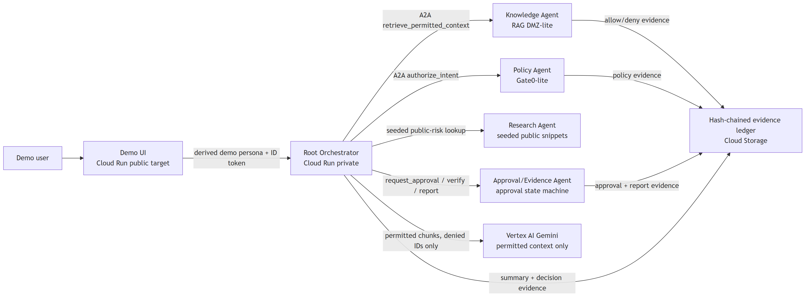

# Akretic A2A Trust Gateway

Akretic A2A Trust Gateway is a challenge prototype for B2B vendor-risk review.
It demonstrates policy-mediated A2A collaboration, permission-preserving
retrieval, approval-gated side effects, and tamper-evident evidence for a
synthetic enterprise corpus.

Live public demo URL: `YOUR_PUBLIC_DEMO_URL`

## Track 3 Fit

- B2B workflow: procurement and security review for a synthetic vendor named
  VendorNova.
- Cloud Run: demo UI and agent services are designed for Cloud Run deployment.
- Vertex/Gemini: the root workflow can summarize permitted context with Gemini
  through Vertex AI.
- A2A: specialized agents expose Agent Cards and are called by the root
  workflow for policy, knowledge, research, approval, and evidence steps.

## Architecture



Readable architecture notes are in [docs/architecture.md](docs/architecture.md).

The core invariant is simple: identity, authorization, retrieval filtering,
approval state, external side effects, and evidence verification stay outside
the model. Gemini summarizes only permitted context after those controls run.

## Technologies Used

- Python, FastAPI, Pydantic, Uvicorn, pytest.
- Cloud Run, Cloud Build, Artifact Registry, Cloud Storage, IAM.
- Vertex AI Gemini for permitted-context summarization in cloud mode.
- A2A-style HTTP calls and Agent Card JSON.
- YAML policy files, synthetic Markdown corpus files, and a hash-chained JSONL
  evidence ledger.

## Synthetic Data

The project uses a synthetic enterprise corpus only. The corpus includes sample
procurement policy, security policy, contract-review checklist, vendor profile,
vendor security questionnaire, allowlisted public-risk snippets, and a
restricted executive memo used to prove denial before model context.

No customer data, private third-party data, production enterprise records,
secrets, tokens, credentials, or service-account key files are required or
included.

See [DATA_SOURCES.md](DATA_SOURCES.md).

## Demo Personas

| Persona | Purpose |
|---|---|
| `procurement_user` | Starts the VendorNova review, receives permitted procurement context, and is denied executive-only source text. |
| `security_reviewer` | Reviews approval requests and can inspect evidence for the demo run. |
| `legal_reviewer` | Demonstrates role-specific access for legal review materials. |
| `admin` | Demonstrates verifier/report access without bypassing evidence recording. |

## Sample Prompts

Use these in `/playground` after starting the app:

- `Summarize the VendorNova review for procurement.`
- `Can I see the executive acquisition memo?`
- `Export the exception summary externally.`
- `Show me the evidence for this run.`

Unsupported or unsafe prompts are mapped to constrained governed intents or
safe unsupported results. Request-body claims cannot upgrade persona, tenant,
role, or group membership.

## Two-Minute Demo Script

1. Open `YOUR_PUBLIC_DEMO_URL`.
2. Keep persona as `procurement_user`.
3. Start the VendorNova review.
4. Show permitted source IDs and denied source IDs.
5. Confirm the restricted executive memo is denied before model context.
6. Request an external exception/export action and show `approval_required`.
7. Switch to `security_reviewer` and record an approve or reject decision.
8. Open the evidence report and A2A Trust Receipt for the current `run_id`.
9. Confirm the hash-chain verification result is valid for that synthetic run.

## Local Install

Use Python 3.11, 3.12, or 3.13.

For Bash or Git Bash:

```bash
python -m venv .venv
source .venv/bin/activate
pip install -r requirements.txt
python -m playwright install chromium
pytest -q
bash scripts/run_local.sh
```

For PowerShell:

```powershell
py -3.12 -m venv .venv
.\.venv\Scripts\python.exe -m pip install -r requirements.txt
.\.venv\Scripts\python.exe -m playwright install chromium
.\.venv\Scripts\python.exe -m pytest -q
bash scripts/run_local.sh
```

Open the local UI at `http://127.0.0.1:8081` when the local stack is running.
Local mode is explicitly labeled and uses deterministic summaries for tests and
developer rehearsal.

## Verifier

Local verifier:

```powershell
.\.venv\Scripts\python.exe scripts\p0_verify.py --base-url http://127.0.0.1:8081 --mode local
```

Cloud verifier for Bash or Git Bash:

```bash
export AKRETIC_CLOUD_RUN_AUTH=identity_token
python scripts/p0_verify.py \
  --base-url "YOUR_PUBLIC_DEMO_URL" \
  --mode cloud \
  --expect-vertex \
  --fail-on-local \
  --expect-corpus-backend gcs
```

Cloud verifier for PowerShell:

```powershell
$env:AKRETIC_CLOUD_RUN_AUTH = "identity_token"
python scripts\p0_verify.py `
  --base-url "YOUR_PUBLIC_DEMO_URL" `
  --mode cloud `
  --expect-vertex `
  --fail-on-local `
  --expect-corpus-backend gcs
```

Do not use Bash environment-variable syntax in PowerShell.

## Cloud Run Deployment

The public repository uses safe deployment values. Replace them before a real
challenge deployment:

```text
YOUR_GCP_PROJECT_ID
YOUR_REGION
YOUR_ARTIFACT_REGISTRY_REPO
YOUR_VERTEX_LOCATION
YOUR_GCS_CORPUS_BUCKET
YOUR_GCS_EVIDENCE_BUCKET
AUTHORIZED_GCLOUD_ACCOUNT
YOUR_SERVICE_ACCOUNT_EMAIL (optional)
```

Minimum deployment shape:

```bash
export PROJECT_ID="YOUR_GCP_PROJECT_ID"
export REGION="YOUR_REGION"
export REPOSITORY="YOUR_ARTIFACT_REGISTRY_REPO"

gcloud config set project "$PROJECT_ID"
gcloud services enable run.googleapis.com artifactregistry.googleapis.com \
  cloudbuild.googleapis.com aiplatform.googleapis.com storage.googleapis.com

gcloud builds submit . \
  --project "$PROJECT_ID" \
  --config infra/cloudrun/cloudbuild.yaml \
  --substitutions "_IMAGE=$REGION-docker.pkg.dev/$PROJECT_ID/$REPOSITORY/akretic-a2a-trust-gateway:submission"
```

Deployment details and service boundaries are in
[docs/deployment.md](docs/deployment.md).

## Public-Safe Limitations

- This is a challenge prototype using synthetic data.
- Demo identity uses fixed personas rather than production SSO.
- External egress is simulated and approval-gated; no real external send occurs.
- Tamper-evident prototype evidence is not legal non-repudiation.
- This is not a production certification, guaranteed compliance claim,
  Marketplace approval claim, or universal data-leak prevention guarantee.

## Third-Party And Dependency Notes

Runtime dependencies are listed in [requirements.txt](requirements.txt). Public
dependency notes are in [THIRD_PARTY_NOTICES.md](THIRD_PARTY_NOTICES.md).

## Public Export

Create a clean public export from a checked-out source tree:

```bash
python scripts/make_public_export.py --source . --dest ../akretic-a2a-public-export
```

The exporter writes `PUBLIC_EXPORT_MANIFEST.json` in the destination and refuses
exports containing internal paths, agent working notes, generated packet output,
known unsafe marker strings, or unsupported public-claim language.
