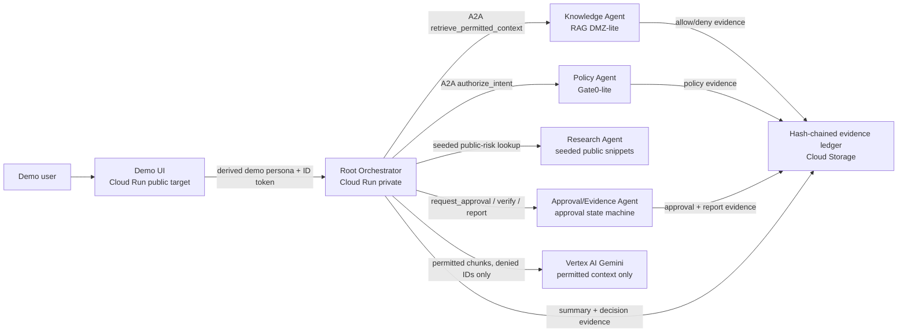

# Architecture

Renderable source: `docs/architecture.mmd`.
Rendered image: `docs/architecture.png`.

## Invariant

Identity, retrieval, tool calls, egress, approvals, and evidence are controlled outside the model.

## Data flow

1. UI sends vendor-risk request with demo persona header.
2. Root derives actor identity from adapter/header/session.
3. Root creates `run_id`.
4. Root calls Policy Agent before material actions.
5. Knowledge Agent retrieves only chunks permitted by metadata and policy.
6. Root passes only permitted chunks to Gemini.
7. Sensitive side-effect requests create approval request.
8. Evidence ledger records all material decisions and results.

## Trust boundary

Gemini may summarize permitted context. Gemini does not decide authorization,
approval, identity, source access, or evidence validity.

## P6 ADK alignment note

The current proof path runs on Cloud Run with Vertex/Gemini summarization and
thin A2A Agent Card skill-call wiring. P6 adds ADK alignment documentation and
an ADK-compatible wrapper around the verified orchestrator path. Authorization,
retrieval filtering, approvals, and evidence remain outside Gemini and are not
delegated to the model.

The P6 wrapper delegates to the existing root orchestrator and does not add
Agent Runtime, Agent Registry, Firestore, embeddings, Google Search grounding,
new public routes, or a replacement runtime path. See `docs/adk_alignment.md`.
